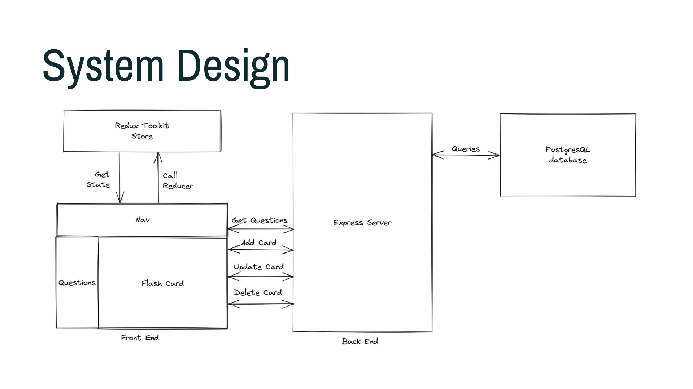

<!-- <div align="center">
  <a href="https://github.com/oslabs-beta/fflow">
    
  </a> -->

<h2 align="center">Flipcards</h2>

<p align="center">
    <strong>Fun and Simple Flashcards</strong>
    <br />
    <a href="https://github.com/crumblepie/flipcards/"><strong>Explore the docs »</strong></a>
    <br />
    <br />
    <a href="#">View Demo</a>
    ·
    <a href="https://github.com/crumblepie/flipcards/issues">Report Bug</a>
    ·
    <a href="https://github.com/crumblepie/flipcards/issues">Request Feature</a>
  </p>
</div>

<p align="center">

  
  
  
    
  <br />
  <br />
  Give a ⭐️ if our project helped or interests you!
</p>

<details open>
  <summary>Table of Contents</summary>
  <ol>
    <li>
      <a href="#about">About Flipcards</a>
      <ul>
       <li><a href="#features">Features</a></li>
        <li><a href="#built-with">Built With</a></li>
      </ul>
    </li>
    <li><a href="#getting-started">Getting Started</a></li>
    <li><a href="#contributing-guide">Contributing Guide</a></li>
    <li><a href="#license">License</a></li>
  </ol>
</details>

## About Flipcards

Flipcards is a simple flashcard game to train your computer science algorithm muscles. Start recognising common problem solving patterns today as the first step to conquering those leetcode problems!

This is an open source project and the purpose of this project is not to be a fully featured app. It creates the foundation for a fun flashcard game based on the below system design. Feel free to fork this repo and make it your own, or create a PR to become a contributor to Flipcards.




### Features

- Add leetcode questions to the relational database
- Display and navigate through the question collection
- Light and Dark Mode
- Run tests in development mode
- Flip the flashcard to see the answer

### Built with

- [Typescript](https://www.typescriptlang.org)
- [React.js](https://reactjs.org/)
- [Webpack 5](https://webpack.js.org)
- [React Icons](https://react-icons.github.io/react-icons/)
- [Jest](https://jestjs.io)
- [Mocha](https://mochajs.org)
- [React Testing Library](https://testing-library.com/docs/react-testing-library/intro/)
- [React–Redux](https://react-redux.js.org)
- [Redux Toolkit](https://redux-toolkit.js.org)
- [PostgreSQL](https://www.postgresql.org)
- [Axios](https://axios-http.com/docs/intro)

<p align="right">(<a href="#top">back to top</a>)</p>

## Getting Started

The following instructions are to get started with Flipcard in development mode:

1. Clone this repo `git clone https://github.com/crumblepie/flipcards`
2. Install the dependencies `npm install`
3. Run script for development mode `npm start-dev`. Navigate to `localhost:8080` in your browser if the port does not automatically open.
4. Build a production build `npm run build-prod`
5. Build a development build `npm run build-dev`
6. Run unit tests `npm run test`

## Use your own database with Flipcards

1. Replace the postgreSQL URI string in `model.js` with your own
2. Create a new table using a statement such as the below:

```sql
CREATE TABLE Algos (
  "_id" serial AUTO INCREMENT PRIMARY KEY,
  "name" varchar NOT NULL,
  "difficulty" varchar NOT NULL,
  "prompt" text NOT NULL,
  "solution" text NOT NULL,
  "pattern" text NOT NULL
)
```

## Add new data to the database

New questions can be added to our relational database with a sql command following this format:

```sql
INSERT INTO "public"."Algos"
VALUES ('9', 'Max Consecutive Ones III', 'Medium',
'Given an array A of 0s and 1s, we may change up to K values from 0 to 1. Return the length of the longest (contiguous) subarray that contains only 1s.', 'Solution to Max Consecutive Ones III', 'Sliding Window');
```

## Contributors

<a href="https://github.com/crumblepie/flipcards/graphs/contributors">
  
</a>

[Rain Hsu](https://github.com/crumblepie) | [Eugene Lee](https://github.com/scc135) | [Jae Hyun Ha](https://github.com/msmintyfresh) | [David Lopez](https://github.com/davidmplopez)

## Contributing Guide

Contributions are welcome and greatly appreciated.

If you have a suggestion of how to make Flipcart better, please follow the below instructions or open an issue with the tag "enhancement".

1. Fork this repo
2. Create your Feature Branch (`git checkout -b` yourgithubhandle/feature-name)
3. Commit your Changes (`git commit -m` 'Add some feature')
4. Create and push to your remote branch (`git push origin` yourgithubhandle/feature-name)
5. Open a Pull Request to `dev` branch

<p align="right">(<a href="#top">back to top</a>)</p>

## License

Licensed under MIT License.
